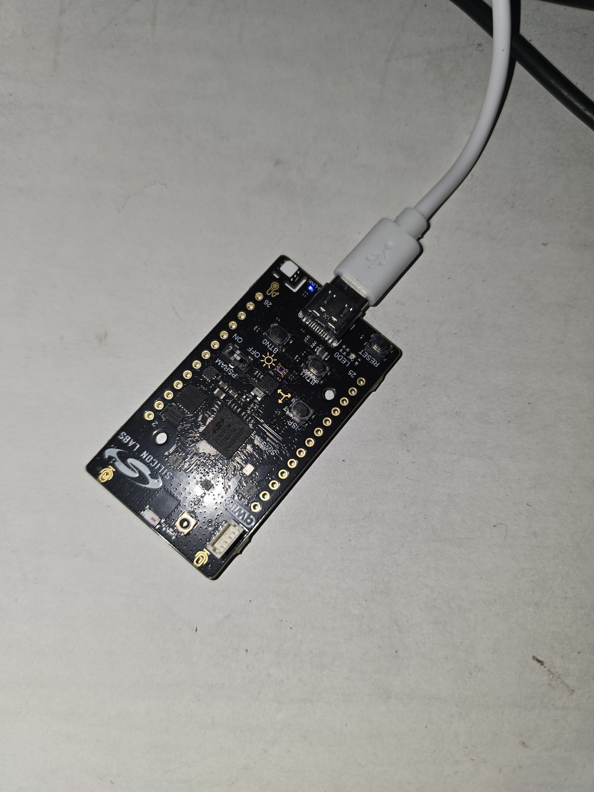
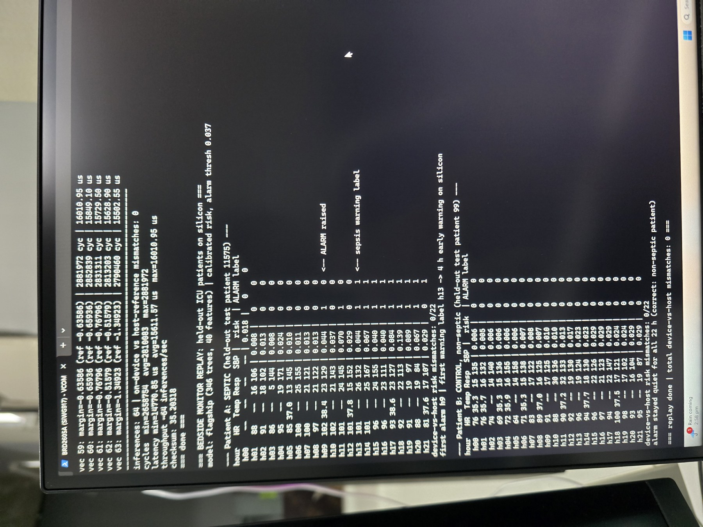

# Real-Time Explainable Sepsis Early-Warning Engine

An end-to-end machine learning model compiled to synthesizable Verilog (verified in RTL simulation) **and to C running on physical Cortex-M4 silicon**, deployed as a real-time explainable bedside monitoring engine. This project trains an XGBoost model on raw vital signs to predict sepsis onset early and demonstrates real-time monitoring via an interactive Dash dashboard.

---

## Project Overview

Sepsis is a critical clinical condition where early intervention is vital—mortality risk increases significantly with every hour of delayed treatment. This repository demonstrates how a machine learning model can be deployed directly to low-power edge hardware (like a bedside FPGA or microcontroller) to provide continuous, low-latency monitoring.

The project is structured around two models:
1. **Server Model (40 features):** Optimizes for prediction accuracy, achieving a cross-validated ROC-AUC of **0.722 ± 0.002** using a full suite of vital signs and engineered temporal features.
2. **Edge Model (4 features):** Shrunk to use only the top 4 vitals (Temperature, Respiratory Rate, Heart Rate, and Systolic Blood Pressure) as 3-hour rolling means. Capped at depth 4, achieving a ROC-AUC of **0.674**. This model is compiled into hardware.

### Deployment Across Three Hardware Targets

The same trained models target three classes of hardware, each with genuinely different constraints — the point being that *sequential vs. combinational execution changes what a model costs*:

| Target | Model | Why this model | Verification |
|---|---|---|---|
| **FPGA / ASIC** | Edge (4 feat, depth 4) | Combinational logic — bounded by **silicon gate area** (the full model needs ~18× the comparators over 10× the input buses) | Bit-exact in RTL simulation (2000/2000 rows) |
| **MCU — SiWG917 (Cortex-M4F)** | **Flagship (40 feat)** | An MCU reuses one FPU across cycles, so a big model costs *time* (µs), not area — the full model fits in ~400 KB of 8 MB flash | Runs on **physical BRD2605A silicon** (see below) |
| **Server** | Flagship (40 feat) | No constraints — maximum accuracy | Cross-validated |

### Key Highlights
- **Strict Patient-Level Split:** Zero patient overlap between training, validation, and testing sets to prevent data leakage and ensure realistic generalization performance.
- **Vitals-Only Inputs:** All administrative and laboratory features are excluded to ensure the model relies purely on real-time bedside vitals.
- **Bit-Exact Hardware Compilation:** The edge model's decision trees are quantized to fixed-point and translated to combinational Verilog, matching the Python model's predictions exactly (2000/2000 rows match in co-simulation).
- **Physical MCU Deployment:** The full flagship model, compiled to float C, runs on a physical Silicon Labs BRD2605A (SiWG917 / Cortex-M4F) — on-device predictions match the host model on all test vectors, with measured inference latency.
- **Bedside Dashboard Demo:** Replays a held-out patient's ICU stay, showing the risk score rise and highlighting the SHAP features driving the alarm.

---

## Validation Rigor & Preventing Data Leakage

Many public models on the PhysioNet 2019 dataset claim inflated ROC-AUC scores (0.95+) by using row-level splits or applying oversampling techniques like SMOTE to the entire dataset prior to splitting. 

To ensure clinical generalizability, I implemented a strict, leak-free validation pipeline:
* **Patient-Level Split:** I use `GroupShuffleSplit` on `patient_id` (80/20 train/test split) to guarantee zero patient overlap. Row-level splitting lets the model memorize patient-specific baselines, which artificially inflates test performance.
* **No SMOTE/Oversampling Leakage:** I avoid oversampling entirely and instead handle class imbalance using class weights (`scale_pos_weight`) during training. Oversampling before train/test splitting interpolates training samples from real test cases, creating massive data leakage.
* **Feature Selection Integrity:** I purged all laboratory and administrative fields (like ICU length of stay) to prevent the model from learning operational indicators or clinical suspicion rather than physiological trends.

---

## Directory Structure

```
├── 01_sepsis_eda_modeling.ipynb        # Full EDA, feature engineering, and model training
├── 01_sepsis_eda_modeling_clean.ipynb  # Cleaned, presentation-ready modeling pipeline
├── 02_mcu_deployment.ipynb             # Flagship model deployed to physical Cortex-M4 silicon
├── HARDWARE_DEPLOYMENT.md              # Notes on the physical MCU deployment
├── models/                             # Saved XGBoost models and isotonic calibration files
├── hw/
│   ├── generate_verilog.py             # Compiles XGBoost trees to Verilog (FPGA path)
│   ├── sepsis_engine.v                 # Generated combinational Verilog engine
│   ├── tb_sepsis_engine.v              # Co-simulation verification testbench
│   ├── tb_demo_patients.v              # Patient streaming simulation demo (Verilog)
│   ├── generate_c.py                   # Compiles the flagship model to float C (MCU path)
│   ├── generate_patient_demo.py        # Builds on-device bedside-replay patient data
│   └── mcu/                            # C model, timing harness, patient-replay app for BRD2605A
├── demo/
│   ├── app.py                          # Interactive Dash dashboard
│   └── prepare_demo.py                 # Extracts test patient and SHAP drivers for demo
├── figures/                            # Waveforms, dashboard, and on-device board photos + logs
├── environment.yml                     # Conda environment spec
└── .gitignore
```

---

## Quick Start

### 1. Environment Setup

Create and activate the conda environment:
```bash
conda env create -f environment.yml
conda activate ml
```

### 2. Run the Machine Learning Pipeline

Open `01_sepsis_eda_modeling.ipynb` in your Jupyter editor and run all cells. This performs exploratory data analysis, trains and tunes both XGBoost models, and exports the serialized boosters to `models/`.

### 3. Generate and Verify the Verilog Engine

Compile the trained edge model into Verilog:
```bash
python hw/generate_verilog.py
```
This writes `hw/sepsis_engine.v` and generates `hw/golden_vectors.csv` for test verification.

To run the bit-exact co-simulation testbench:
```bash
# Using Icarus Verilog:
iverilog -o hw/sim.vvp hw/sepsis_engine.v hw/tb_sepsis_engine.v
vvp hw/sim.vvp
```
*(Alternatively, you can load these files into Xilinx Vivado and run the simulation using XSim).*


### 4. Launch the Bedside Monitor Demo

Prepare the demo patient assets and run the interactive dashboard:
```bash
python demo/prepare_demo.py
python demo/app.py
```
Then navigate to `http://127.0.0.1:8050` in your web browser.


---

## Physical MCU Deployment (Silicon Labs BRD2605A / SiWG917)

*Added as a later extension, after gaining hands-on access to a Silicon Labs BRD2605A (SiWG917) evaluation kit through a hardware workshop during a CFHE internship — see [`HARDWARE_DEPLOYMENT.md`](HARDWARE_DEPLOYMENT.md).*

Where the FPGA path compiles the *4-feature edge model* to combinational Verilog (bounded by gate area), the MCU has a hardware FPU and megabytes of flash — so it runs the **full 40-feature flagship model** directly in float C. The C model is generated from the same trained booster and reproduces the Python model on all 2000 held-out validation vectors (max margin difference ~1e-7, zero decision mismatches). Full walkthrough in [`02_mcu_deployment.ipynb`](02_mcu_deployment.ipynb) and [`hw/mcu/README.md`](hw/mcu/README.md).

```bash
python hw/generate_c.py            # emit float C from the flagship model + validation vectors
python hw/generate_patient_demo.py # build the on-device bedside-replay patient data
# then build/flash the hw/mcu/ sources in Simplicity Studio for the BRD2605A
```

**Measured on the board** (Cortex-M4F @ 180 MHz, timed with the DWT cycle counter):

| | Result |
|---|---|
| On-device vs host-model agreement | **64/64 benchmark vectors, 0 mismatches** |
| Inference latency | **~15.6 ms avg** (flash-resident model; memory locality dominates, not compute) |
| Bedside replay — septic patient | **alarm 4 h before the sepsis label** |
| Bedside replay — control patient | **0 false alarms across 22 h** |
| Device vs host calibrated-risk agreement | **0 mismatches / 44 patient-hours** |

The bedside replay streams **real held-out ICU patients** through the model on silicon, computing the same calibrated risk (`isotonic(sigmoid(margin))`) and alarm the dashboard uses:




Two honest, distinct hardware claims: the **FPGA path** is bit-exact in RTL simulation (no physical board); the **MCU path** runs on physical silicon with measured latency and on-device-vs-host agreement. Both are generated from the same trained model.

---

## Dataset

The model is trained on the public **PhysioNet / Computing in Cardiology Challenge 2019** dataset, which consists of hourly records from over 40,000 ICU patients. 

*Note: Raw data files are not committed to this repository. You can download the dataset from [PhysioNet](https://physionet.org/content/challenge-2019/1.0.0/) and place the directories under a `data/` folder.*

---

## Technical Stack

- **ML & Data Processing:** Python, Pandas, Numpy, Scikit-learn, XGBoost, Optuna
- **Visualizations:** Plotly/Dash (Dashboard), Matplotlib, Seaborn
- **Hardware/HDL:** Verilog, Icarus Verilog, Xilinx Vivado (XSim)
- **Embedded:** C, Silicon Labs Simplicity Studio, SiWG917 / Cortex-M4F (BRD2605A)
