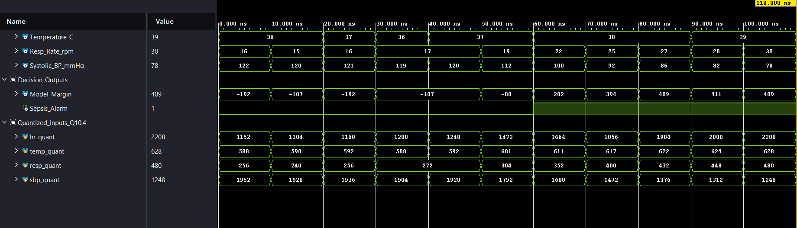
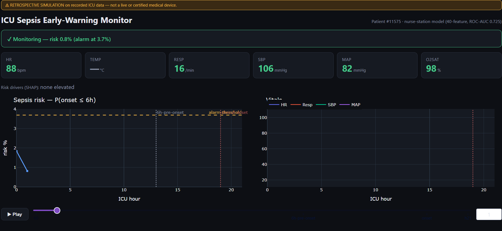

# Real-Time Explainable Sepsis Early-Warning Engine

An end-to-end machine learning model compiled to synthesizable Verilog, verified in RTL simulation, and deployed as a real-time explainable bedside monitoring engine. This project trains an XGBoost model on raw vital signs to predict sepsis onset early and demonstrates real-time monitoring via an interactive Dash dashboard.

---

## Project Overview

Sepsis is a critical clinical condition where early intervention is vital—mortality risk increases significantly with every hour of delayed treatment. This repository demonstrates how a machine learning model can be deployed directly to low-power edge hardware (like a bedside FPGA or microcontroller) to provide continuous, low-latency monitoring.

The project is structured around two models:
1. **Server Model (40 features):** Optimizes for prediction accuracy, achieving a cross-validated ROC-AUC of **0.722 ± 0.002** using a full suite of vital signs and engineered temporal features.
2. **Edge Model (4 features):** Shrunk to use only the top 4 vitals (Temperature, Respiratory Rate, Heart Rate, and Systolic Blood Pressure) as 3-hour rolling means. Capped at depth 4, achieving a ROC-AUC of **0.674**. This model is compiled into hardware.

### Key Highlights
- **Strict Patient-Level Split:** Zero patient overlap between training, validation, and testing sets to prevent data leakage and ensure realistic generalization performance.
- **Vitals-Only Inputs:** All administrative and laboratory features are excluded to ensure the model relies purely on real-time bedside vitals.
- **Bit-Exact Hardware Compilation:** The edge model's decision trees are quantized to fixed-point and translated to combinational Verilog, matching the Python model's predictions exactly (2000/2000 rows match in co-simulation).
- **Bedside Dashboard Demo:** Replays a held-out patient's ICU stay, showing the risk score rise and highlighting the SHAP features driving the alarm.

---

## Validation Rigor & Preventing Data Leakage

Many public models on the PhysioNet 2019 dataset claim inflated ROC-AUC scores (0.95+) by using row-level splits or applying oversampling techniques like SMOTE to the entire dataset prior to splitting. 

To ensure clinical generalizability, I implemented a strict, leak-free validation pipeline:
* **Patient-Level Split:** I use `GroupShuffleSplit` on `patient_id` (80/20 train/test split) to guarantee zero patient overlap. Row-level splitting lets the model memorize patient-specific baselines, which artificially inflates test performance.
* **No SMOTE/Oversampling Leakage:** I avoid oversampling entirely and instead handle class imbalance using class weights (`scale_pos_weight`) during training. Oversampling before train/test splitting interpolates training samples from real test cases, creating massive data leakage.
* **Feature Selection Integrity:** I purged all laboratory and administrative fields (like ICU length of stay) to prevent the model from learning operational indicators or clinical suspicion rather than physiological trends.

---

## Directory Structure

```
├── 01_sepsis_eda_modeling.ipynb        # Full EDA, feature engineering, and model training
├── 01_sepsis_eda_modeling_clean.ipynb  # Cleaned, presentation-ready modeling pipeline
├── models/                             # Saved XGBoost models and isotonic calibration files
├── hw/
│   ├── generate_verilog.py             # Compiles XGBoost trees to Verilog
│   ├── sepsis_engine.v                 # Generated combinational Verilog engine
│   ├── tb_sepsis_engine.v              # Co-simulation verification testbench
│   └── tb_demo_patients.v              # Patient streaming simulation demo
├── demo/
│   ├── app.py                          # Interactive Dash dashboard
│   └── prepare_demo.py                 # Extracts test patient and SHAP drivers for demo
├── figures/                            # Waveform screenshots and dashboard images
├── environment.yml                     # Conda environment spec
└── .gitignore
```

---

## Quick Start

### 1. Environment Setup

Create and activate the conda environment:
```bash
conda env create -f environment.yml
conda activate ml
```

### 2. Run the Machine Learning Pipeline

Open `01_sepsis_eda_modeling.ipynb` in your Jupyter editor and run all cells. This performs exploratory data analysis, trains and tunes both XGBoost models, and exports the serialized boosters to `models/`.

### 3. Generate and Verify the Verilog Engine

Compile the trained edge model into Verilog:
```bash
python hw/generate_verilog.py
```
This writes `hw/sepsis_engine.v` and generates `hw/golden_vectors.csv` for test verification.

To run the bit-exact co-simulation testbench:
```bash
# Using Icarus Verilog:
iverilog -o hw/sim.vvp hw/sepsis_engine.v hw/tb_sepsis_engine.v
vvp hw/sim.vvp
```
*(Alternatively, you can load these files into Xilinx Vivado and run the simulation using XSim).*



### 4. Launch the Bedside Monitor Demo

Prepare the demo patient assets and run the interactive dashboard:
```bash
python demo/prepare_demo.py
python demo/app.py
```
Then navigate to `http://127.0.0.1:8050` in your web browser.



---

## Dataset

The model is trained on the public **PhysioNet / Computing in Cardiology Challenge 2019** dataset, which consists of hourly records from over 40,000 ICU patients. 

*Note: Raw data files are not committed to this repository. You can download the dataset from [PhysioNet](https://physionet.org/content/challenge-2019/1.0.0/) and place the directories under a `data/` folder.*

---

## Technical Stack

- **ML & Data Processing:** Python, Pandas, Numpy, Scikit-learn, XGBoost, Optuna
- **Visualizations:** Plotly/Dash (Dashboard), Matplotlib, Seaborn
- **Hardware/HDL:** Verilog, Icarus Verilog, Xilinx Vivado (XSim)
